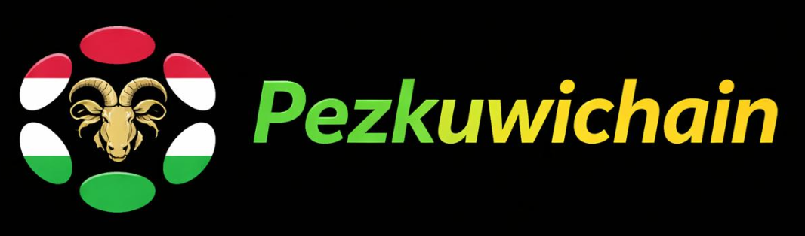
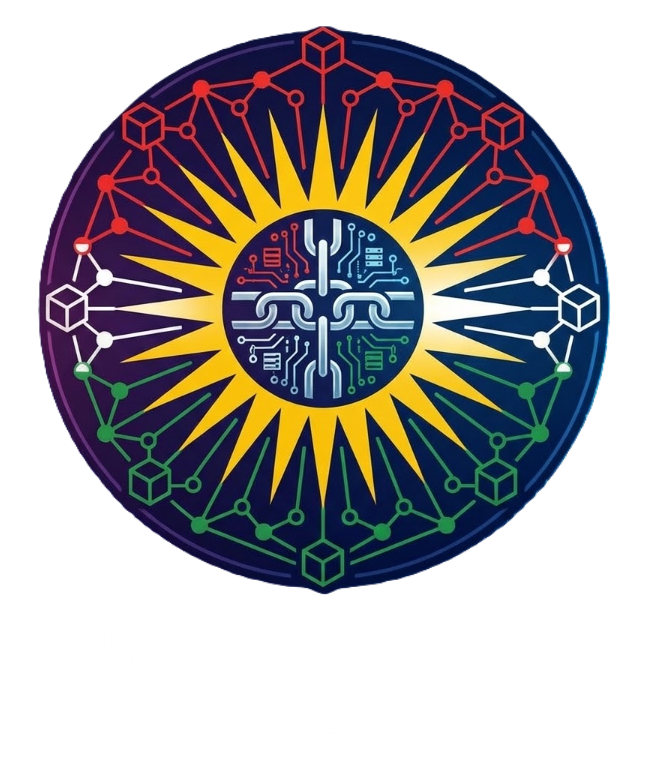
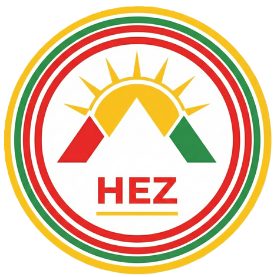
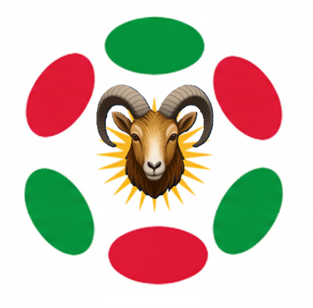
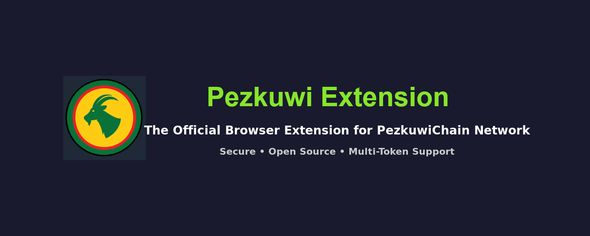
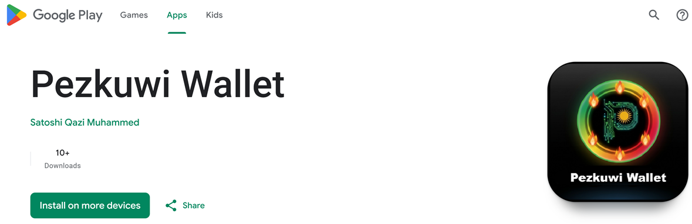

<div align="center">



# Pezkuwi DKS — Digital Kurdistan State

**Sovereign blockchain infrastructure · maintained by Kurdistan Tech Institute**

[](https://github.com/pezkuwichain/pezkuwi-DKS/actions/workflows/check.yml)
[](#license--attribution)
[](./rust-toolchain.toml)
[](https://pezkuwichain.io)
[](https://pex.mom)



</div>

> **DKS — Digital Kurdistan State.** This repository is the complete, self-contained blockchain
> stack of PezkuwiChain: the framework, the relay-chain and system-parachain runtimes, and the
> original FRAME pallets that encode the state's citizenship, governance, treasury, and identity.

PezkuwiChain is the sovereign blockchain of the **Digital Kurdistan State** — a digital home for
the Kurdish nation and for other stateless and distributed communities. This is a **self-contained
monorepo**: the framework, runtimes, and pallets all live here and build from source, with no
dependency on any external package registry. That independence is deliberate — the chain must
remain buildable and verifiable no matter what happens to any third-party platform.

---

## Layout

| Component | Path | Description |
| --- | --- | --- |
| **Bizinikiwi** | `bizinikiwi/` | Core framework (runtime engine, primitives, FRAME, client) |
| **Relay chain** | `pezkuwi/` | PezkuwiChain relay chain (`pezkuwichain-runtime`) + node |
| **PezCumulus** | `pezcumulus/` | Parachain framework + system-parachain runtimes (Asset Hub, People) |
| **Bridges** | `pezbridges/` | Cross-chain bridge primitives and pallets |

### Networks

- **PezkuwiChain** — mainnet (`pezkuwichain-runtime`, Asset Hub & People parachains)
- **Zagros** — test network (`zagros-runtime` and its system parachains)

### Original pallets

PezkuwiChain's sovereign logic — with no upstream equivalent — lives in
`pezcumulus/teyrchains/pezpallets/`: `tiki` (citizenship), `welati` (governance),
`perwerde` (education), `pez-treasury`, `pez-rewards`, `trust`, `identity-kyc`,
`presale`, `referral`, `staking-score`, `token-wrapper`, `messaging`.

---

## Tokens

<table>
<tr>
<td align="center" width="160"><br/><b>HEZ</b></td>
<td>Native gas token (relay chain) — transaction fees, staking, network security.</td>
</tr>
<tr>
<td align="center" width="160"><br/><b>PEZ</b></td>
<td>Governance token (Asset Hub) — citizenship-gated, fixed supply.</td>
</tr>
</table>

---

## Building

```bash
# Check a runtime
cargo check -p pezkuwichain-runtime

# Build all runtime WASM (release)
cargo build --release

# Build with benchmarks / try-runtime
cargo build --release --features runtime-benchmarks
```

The pinned toolchain is declared in [`rust-toolchain.toml`](./rust-toolchain.toml). Builds are
reproducible from a tagged commit together with the committed `Cargo.lock`.

---

## Ecosystem

<table>
<tr>
<td align="center"><br/><b>Pezkuwi Extension</b><br/>Accounts &amp; transaction signing</td>
<td align="center"><br/><b>Pezkuwi Wallet</b><br/>Mobile wallet for the network</td>
</tr>
</table>

| Resource | URL |
| --- | --- |
| Website | [pezkuwichain.io](https://pezkuwichain.io) |
| Exchange (PEX) | [pex.mom](https://pex.mom) |
| App | [app.pezkuwichain.io](https://app.pezkuwichain.io) |
| Documentation | [docs.pezkuwichain.io](https://docs.pezkuwichain.io) |

---

## License & Attribution

The code in this repository is a derivative work based on
[Polkadot SDK](https://github.com/paritytech/polkadot-sdk) (snapshot `stable2512`) by
[Parity Technologies (UK) Ltd.](https://www.parity.io), used under **Apache-2.0** and **GPL-3.0**.

Individual crates are licensed under one of:

- **Apache License, Version 2.0** — see [LICENSE-APACHE](./LICENSE-APACHE)
- **GNU General Public License v3 or later WITH Classpath-exception-2.0** — see [LICENSE-GPL3](./LICENSE-GPL3)

See each crate's `Cargo.toml` `license` field and each source file's `SPDX-License-Identifier`
header. Full attribution and the list of significant changes are in [NOTICE](./NOTICE).

Brand heritage and visual identity: [`docs/BRAND_HERITAGE.md`](./docs/BRAND_HERITAGE.md),
[`docs/VISUAL_IDENTITY.md`](./docs/VISUAL_IDENTITY.md).

---

<div align="center">

**Kurdistan Tech Institute** · *Sovereign infrastructure for stateless nations*

</div>
