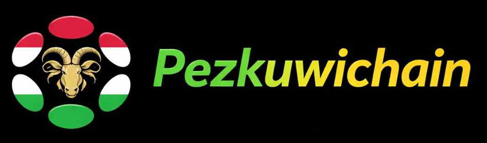
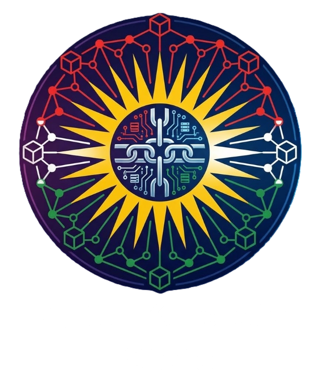
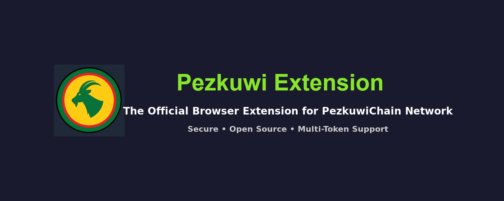
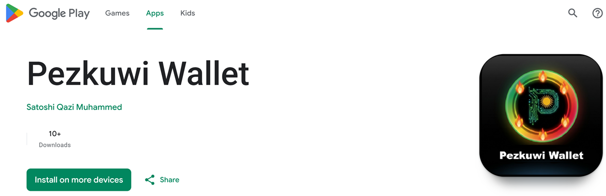

<div align="center">



# Pezkuwi DKS — Digital Kurdistan State

**Sovereign blockchain infrastructure · maintained by Kurdistan Tech Institute**

[](https://github.com/pezkuwichain/pezkuwi-DKS/actions/workflows/check.yml)
[](#license--attribution)
[](./rust-toolchain.toml)
[](https://pezkuwichain.io)
[](https://pex.network)



</div>

> **DKS — Digital Kurdistan State.** This repository is the complete, self-contained blockchain
> stack of PezkuwiChain: the framework, the relay-chain and system-parachain runtimes, and the
> original FRAME pallets that encode the state's citizenship, governance, treasury, and identity.

PezkuwiChain is the sovereign blockchain of the **Digital Kurdistan State** — a digital home for
the Kurdish nation and for other stateless and distributed communities. This is a **self-contained
monorepo**: the framework, runtimes, and pallets all live here and build from source, with no
dependency on any external package registry. That independence is deliberate — the chain must
remain buildable and verifiable no matter what happens to any third-party platform.

---

## State architecture

A chain that claims to be a state has to answer questions a chain does not: who is a person,
who may command, who may spend, and what no majority may take away. This is the design those
answers are built toward. Progress against it is tracked elsewhere; what follows is the
architecture itself.

Three premises shape every decision below.

**Half of a constitution answers problems of scale, distance and information.** Those problems
do not survive digitisation: everyone is equidistant from the chain, counting is free, and the
record is one record. The other half answers problems of human nature, and those are untouched.
The first half is rebuilt from scratch here; the second half is kept.

**A digital state cannot compel.** Every physical state's last resort is force. This one has
none. It cannot punish, only refuse — so its whole legal architecture rests on conditional
access rather than penalty.

**Delay is the only check that cannot be bought.** On a chain, money buys votes, attention and
hashpower. It does not buy time. Constitutional protection is therefore built out of mandatory
delay rather than out of thresholds alone.

### Layer 0 — the register

Everything rests on knowing that a citizen is one person. The answer is economic, not
cryptographic: registration is vouched for, and vouching costs something.

```
genesis ──► founding citizen ──► chain of guarantee ──► the population threshold
```

A citizen vouches for another. The voucher is liable: if the person they vouched for is
revoked, the voucher's own standing falls, and the loss travels up the chain, diminishing. The
capacity to vouch is bounded and earned — a new citizen waits, and the number they may vouch
for grows with time and with the record of those they vouched for before. The tree is public,
so a manufactured cluster is visible as a subtree with an anomalous revocation rate.

Forging the register is possible in the sense that robbing a bank is possible. Cost, detection
and consequence multiply; that product is the security, not an impossibility proof. And the
product grows with the population: the register is weakest at birth and strengthens
monotonically, which is why the founding period runs under different rules that expire.

The register is written by the judiciary alone. Whoever writes the electorate wins the
election, so no organ that stands in one may write it.

### The five powers

Three sufficed in 1787. A chain requires two more separations.

```
                    ┌──────────────────────────────────┐
                    │  REGISTER — who is a person      │
                    │  vouching · citizenship          │
                    │  isolated from politics          │
                    └────────────────┬─────────────────┘
                                     │ defines the electorate
       ┌─────────────────────────────┼─────────────────────────────┐
       │                             │                             │
 ┌─────┴──────┐              ┌───────┴───────┐            ┌────────┴────────┐
 │ LEGISLATURE│◄────────────►│   EXECUTIVE   │◄──────────►│    JUDICIARY    │
 │ what the   │   oversight  │ discretion    │   review   │ fact · intent   │
 │ rules are  │              │ representation│            │ fraud · the     │
 │            │              │ emergency     │            │ register        │
 └─────┬──────┘              └───────┬───────┘            └────────┬────────┘
       │ appropriates                │ spends                      │ forfeits
       └──────────────┬──────────────┘                             │
                      ▼                                            │
            ┌──────────────────────┐                               │
            │      TREASURY        │◄──────────────────────────────┘
            │ appropriation ≠ spend│
            └──────────────────────┘
```

**No organ writes its own input.** The legislature's electorate comes from the register; the
executive's authority from the legislature; the judiciary's commission from a nomination the
legislature confirms; the treasury's appropriation from the legislature; the register's rules
from the legislature and the judiciary, never from the executive. Each arrow points somewhere
else. The moment the cycle closes, the state reproduces itself.

### Two franchises

The vote belongs to whoever bears the consequence, and different subjects have different
bearers.

| subject | counted | where |
|---|---|---|
| Citizenship, offices, the judiciary, the constitution | one citizen, one vote | People chain |
| Token parameters, fees, treasury scale | by holding | Asset Hub |

The two track lists are disjoint and held apart by a gate. An origin appearing in both would
let a holding reach a state power, and the register would be for sale.

### Every act has three moments, in three different hands

```
   PROPOSE                DECIDE                    EXECUTE

law        citizen initiative  →  referendum          →  automatic
appointment executive          →  parliament (yes/no) →  the mandate is recorded
money      minister            →  parliament's        →  within the ceiling
                                  appropriation
justice    a case              →  the court           →  graded exclusion
emergency  a judge proposes    →  parliament, 101+    →  the President, for two months
```

The confirming body cannot nominate; it answers yes or no to a name it did not choose. A call
that let it write a name would turn a presidential system into a parliamentary one.

Offices differ in who confirms them, and the line is drawn by law rather than by code: the
cabinet, the bench, the treasurer and the ambassador are confirmed by parliament; ordinary
posts are filled by the responsible minister; personal advisers need no confirmation.

### Entrenchment, by time

```
register rules     announce 90d + vote 90d + enactment 30d
rights             announce 60d + vote 60d
constitution       announce  7d + vote 28d          (the runtime itself)
ordinary law       announce  2d + vote 14d
appropriation      periodic
administration     immediate
emergency halt     immediate — and lapses in seven days
```

The pyramid is inverted on purpose: the most fundamental rule is the slowest to change. A right
that takes five months to remove is a right; a two-thirds threshold can be bought.

*Upgrade is constitution and the people decide it; a parameter is policy and whoever bears it
decides.* An upgrade can change anything, origins included, so the authority to upgrade belongs
to the head-counted franchise — and parameters that a holding should govern are settable
without one.

### Enforcement, by graded exclusion

```
warning → fee → suspension of a right → suspension of standing → removal from the register
                                                                  ▲
                                                    the court alone · two thirds
                                                    restoration by one third
                                                    ninety days before it takes effect
```

Removal from the register is this state's capital sentence: it takes citizenship itself. One
organ may impose it, it does not take effect for ninety days, and it is easier to undo than to
do.

### The economy

Two tokens with opposite monetary policies, deliberately.

```
HEZ — the state's working money          PEZ — the citizens' money
native · inflationary                    a fixed five billion · halving every four years
staking · fees · collateral              no mint path exists, sudo included
                                         released from a pre-allocated treasury

fee income                               monthly release
  relay      80% treasury / 20% author     75% incentive pot ──► every citizen, by standing
  teyrchains 100% collator pot             25% government pot ─► the budget
             (their only income; relay              after the population threshold, once
              validators have inflation)             crossed and never uncrossed
```

The state pays its citizens. Standing is composed of education, vouching, qualification and
stake, weighted, and a zero stake yields a zero standing — an economy is what lets a state act,
so participation in it is a condition of standing rather than a substitute for it.

Holding office earns the person nothing. An office commands a budget; it does not pay the
person who holds it, and no office contributes to standing. Parliament is an institution with
a pot of its own: it sets its members' pay annually by a vote of 101, and its running costs are
a budget the people approve.

### Invariants

No majority reaches these. They are the architecture, not a law within it.

```
1. one citizen = one record = one vote
2. a zero stake yields a zero standing
3. PEZ cannot be minted or burnt — sudo included
4. the appropriation ceiling cannot be exceeded
5. no organ writes its own input
6. the proposer does not confirm
7. holding office earns the holder nothing
8. removal from the register comes only from the court, and is appealable
9. emergency power only stops, and lapses on its own
```

### Where each organ lives

```
relay        consensus, security, the shared code
People       the register · the civil process · the head-counted ballot
Asset Hub    the treasury · PEZ · staking · the holding-weighted ballot
Bridge Hub   relations beyond the chain
Coretime     infrastructure
```

Territory has no analogue here. A chain cannot know where a person is, and every design that
tries either trusts an oracle that can lie or writes a location nobody should have to publish.
Law therefore follows the register a person is in rather than the ground they stand on — which
is a membership they choose, and so must carry a waiting period, or the choice is made per
transaction and means nothing. Rights do not divide by membership; local administration does.

## Layout

| Component | Path | Description |
| --- | --- | --- |
| **Bizinikiwi** | `bizinikiwi/` | Core framework (runtime engine, primitives, FRAME, client) |
| **Relay chain** | `pezkuwi/` | PezkuwiChain relay chain (`pezkuwichain-runtime`) + node |
| **PezCumulus** | `pezcumulus/` | Parachain framework + system-parachain runtimes (Asset Hub, People) |
| **Bridges** | `pezbridges/` | Cross-chain bridge primitives and pallets |

### Networks

- **PezkuwiChain** — mainnet (`pezkuwichain-runtime`, Asset Hub & People parachains)
- **Zagros** — test network (`zagros-runtime` and its system parachains)

### Original pallets

PezkuwiChain's sovereign logic — with no upstream equivalent — lives in
`pezcumulus/teyrchains/pezpallets/`: `tiki` (citizenship), `welati` (governance),
`perwerde` (education), `pez-treasury`, `pez-rewards`, `trust`, `identity-kyc`,
`presale`, `referral`, `staking-score`, `token-wrapper`, `messaging`.

---

## Tokens

<table>
<tr>
<td align="center" width="160"><br/><b>HEZ</b></td>
<td>Native gas token (relay chain) — transaction fees, staking, network security.</td>
</tr>
<tr>
<td align="center" width="160"><br/><b>PEZ</b></td>
<td>Governance token (Asset Hub) — citizenship-gated, fixed supply.</td>
</tr>
</table>

---

## Building

```bash
# Check a runtime
cargo check -p pezkuwichain-runtime

# Build all runtime WASM (release)
cargo build --release

# Build with benchmarks / try-runtime
cargo build --release --features runtime-benchmarks
```

The pinned toolchain is declared in [`rust-toolchain.toml`](./rust-toolchain.toml). Builds are
reproducible from a tagged commit together with the committed `Cargo.lock`.

---

## Ecosystem

<table>
<tr>
<td align="center"><br/><b>Pezkuwi Extension</b><br/>Accounts &amp; transaction signing</td>
<td align="center"><br/><b>Pezkuwi Wallet</b><br/>Mobile wallet for the network</td>
</tr>
</table>

| Resource | URL |
| --- | --- |
| Website | [pezkuwichain.io](https://pezkuwichain.io) |
| Exchange (PEX) | [pex.network](https://pex.network) |
| App | [app.pezkuwichain.io](https://app.pezkuwichain.io) |
| Documentation | [docs.pezkuwichain.io](https://docs.pezkuwichain.io) |

---

## License & Attribution

The code in this repository is a derivative work based on
[Polkadot SDK](https://github.com/paritytech/polkadot-sdk) (snapshot `stable2512`) by
[Parity Technologies (UK) Ltd.](https://www.parity.io), used under **Apache-2.0** and **GPL-3.0**.

Individual crates are licensed under one of:

- **Apache License, Version 2.0** — see [LICENSE-APACHE](./LICENSE-APACHE)
- **GNU General Public License v3 or later WITH Classpath-exception-2.0** — see [LICENSE-GPL3](./LICENSE-GPL3)

See each crate's `Cargo.toml` `license` field and each source file's `SPDX-License-Identifier`
header. Full attribution and the list of significant changes are in [NOTICE](./NOTICE).

Brand heritage and visual identity: [`docs/BRAND_HERITAGE.md`](./docs/BRAND_HERITAGE.md),
[`docs/VISUAL_IDENTITY.md`](./docs/VISUAL_IDENTITY.md).

---

<div align="center">

**Kurdistan Tech Institute** · *Sovereign infrastructure for stateless nations*

</div>
