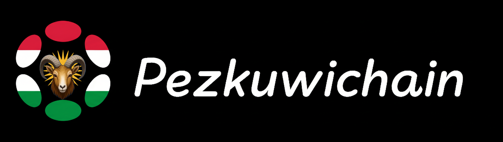
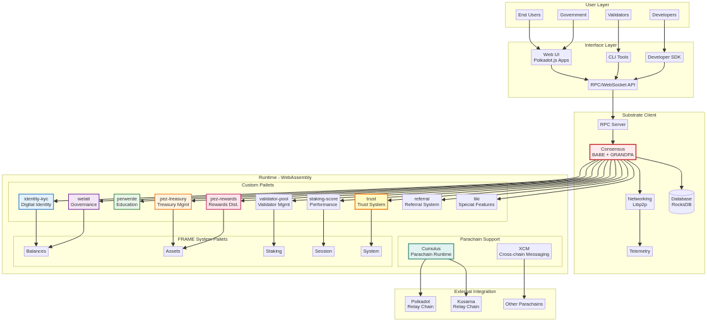
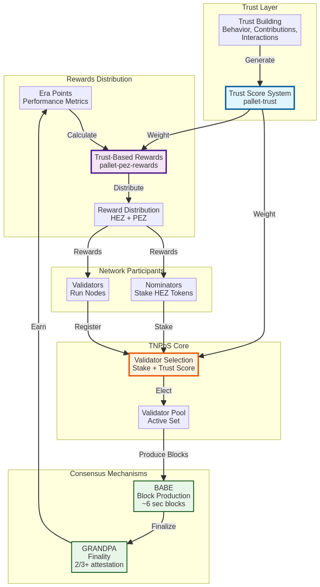
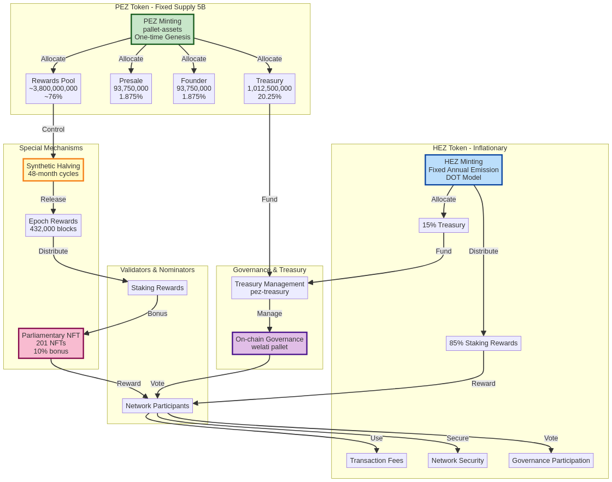
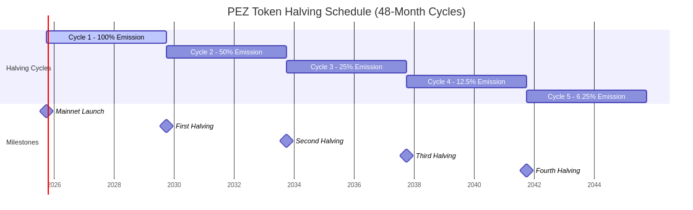

# PezkuwiChain: A Sovereign Blockchain for a Digital Nation
**Technical Whitepaper v4.0**
**December 10, 2025**
**Prepared by:** Kurdistan Tech Ministry & PezkuwiChain Contributors



---

## Abstract: THE PEZKUWICHAIN MANIFESTO - BUILDING TRUTH IN AN AGE OF NOISE

We are in the midst of a digital dark age.

Blockchain technology arrived with the promise of decentralization, transparency, and freedom for humanity. Yet, what we see today when we look back is a colossal casino built upon these sacred promises. Thousands of projects, tens of thousands of tokens, millions of empty vows... all designed to glitter for a moment as a line item on the shimmering lists of exchanges, only to be swallowed by darkness after exploiting the hopes of investors.

Exchanges have become the gatekeepers of volume, not technology. True engineering has been crushed under the weight of marketing noise. Genuine projects that could add value to humanity, spread financial freedom, and digitize identity and reputation have been lost among a sea of "scam" projects, meme tokens, and digital refuse with no technological substance. This chaos was not created by external forces, but by the blockchain world's own insatiable greed.

**Enough.**

We, as PezkuwiChain, reject this noise. We see technology not as a tool for speculation, but as a tool for building a civilization.

### THE PARADIGM SHIFT: T-NPoS (Trust-Nominated Proof of Stake)

Throughout history, power has always been concentrated in the hands of capital. Traditional Proof of Stake (PoS) systems have unfortunately carried this old-world disease into the digital realm: "He who has the gold makes the rules." This is an oligarchy we refuse to accept.

With PezkuwiChain, we are initiating a revolution: **T-NPoS.**

T-NPoS is a consensus mechanism based not only on the balance in your wallet (Stake), but on the value you bring to the network, your reputation, and your trustworthiness (Trust). As a philosopher, I say: Capital is not character. Money is not merit.

In PezkuwiChain:
- The network is governed not just by the wealthy, but by the trustworthy.
- Validators are chosen not just by locking tokens, but by proving their loyalty to the community and the network.
- The **HEZ Token** provides the network's security and economic foundation (Layer 1), while the **PEZ Token** is a currency of reputation that rewards labor, participation, and trust.

This dual structure balances the power of capital with the honor of contribution. Our custom modules, such as `Identity`, `Society`, and `RankedCollective`, are the technical proof of this philosophy. We are not building a mechanized financial system; we are building a human-centric, trust-based digital society.

### THE ANSWER TO THE LOST AND THE ERASED

Unlike the endless stream of projects that appear daily only to be listed and disappear on exchanges, PezkuwiChain is not a "pump-and-dump" scheme. Our code is built on a robust, open-source foundation, but it has forged its own soul, its own economy, and its own form of governance.

We trust in the code of developers, not the listing fees of exchanges. We believe in sustainable ecosystems, not fleeting hype.

### CONCLUSION: THE HISTORICAL PARADOX AND THE JOURNEY TO A TYPE-1 CIVILIZATION

PezkuwiChain is a technological cry emanating from Erbil to the world, yet this cry contains one of history's greatest paradoxes.

The Kurdish people's centuries-long state of "statelessness" has, ironically, become their greatest advantage and superpower in this technological age. Established states must expend immense time and energy to refactor their cumbersome centuries-old bureaucracies, inefficient paper-based institutions, and centralized structures for the blockchain era. They are the ones who cannot build anew without first demolishing the old.

The Kurdish people, however, do not carry the burden of these legacy systems. They have no inefficient bureaucracies to transform, no decrepit institutions to tear down. This situation presents us with a digital "clean slate."

**Building, Not Adapting:** We will not waste time transforming the old; we will directly build the most advanced technology, the most transparent governance, and the most equitable economy from the ground up.

**A Leap to a Type-1 Civilization:** While other nations struggle with their internal resistance to change, PezkuwiChain will bring the children of this region to the level of a digital "Type-1 Civilization" far faster than any other nation.

**From the Age of Race to the Age of Culture:** Borders are no longer drawn with soil, but with code. The era of the nation-state centered "only on race" has closed; a new era of the nation centered on "Race + Culture + Technology" has begun.

PezkuwiChain is the digital fortress of this new age. We are building a new world where trust, not capital, and values, not borders, reign supreme.

We are here. We have no baggage, only velocity. We are PezkuwiChain.

---

## 1. Executive Summary

PezkuwiChain is a sovereign Layer-1 blockchain network meticulously engineered to serve the digital infrastructure needs of the Kurdistan region and its global diaspora. Built using the **Pezkuwi SDK**—a powerful framework forged from battle-tested, open-source components—PezkuwiChain introduces a novel **Trust-enhanced Nominated Proof-of-Stake (TNPoS)** consensus mechanism, a sophisticated dual-token economic model, and a comprehensive suite of custom-built pallets for governance, identity, and education.

The project's vision is to empower the Kurdish nation through decentralized technology, fostering a transparent, community-driven ecosystem that integrates financial inclusion, digital identity, and social trust into its core consensus layer. This whitepaper provides a comprehensive overview of the PezkuwiChain architecture, its groundbreaking TNPoS consensus, technical specifications, and strategic roadmap.

**Core Innovations:**
*   **TNPoS Consensus:** The world's first trust-augmented PoS mechanism.
*   **Dual-Token Economy:** HEZ (inflationary) + PEZ (fixed 5B supply).
*   **Multi-Layered "Teyrchain" Architecture:** A Relay Chain for consensus, an Asset Hub for economy, and a People Chain for identity and governance.
*   **The Pezkuwi SDK:** A powerful and flexible framework with **14** specialized modules for digital sovereignty.

---

## 2. Introduction

The emergence of blockchain technology has offered unprecedented opportunities to create decentralized, transparent, and secure digital infrastructures. However, most existing blockchain solutions are designed as general-purpose platforms, often failing to address the specific cultural, economic, and governance needs of distinct communities. PezkuwiChain was born from the vision of creating a dedicated digital state for the Kurdish nation, aiming to leverage the power of the blockchain to address long-standing challenges and build a foundation for a prosperous digital future. The mission is to serve the public by providing the Kurdish people with a secure and decentralized platform for financial services, digital identity, democratic governance, and education.

---

## 3. The Problem

Traditional financial and administrative systems often present significant barriers to entry, lack transparency, and are ill-suited to the unique needs of a globally dispersed yet culturally unified nation. The Kurdish people face distinct challenges that a sovereign digital infrastructure can address:

- **Financial Exclusion:** A significant portion of the population lacks access to modern banking and financial services.
- **Lack of Digital Sovereignty:** The absence of a unified, sovereign digital identity system complicates civic participation and access to services.
- **Governance Gaps:** Centralized governance models can be opaque and lack mechanisms for broad, democratic participation.
- **Economic Volatility:** National economies are often vulnerable to the volatility of external currencies.
- **The Trust Deficit in Blockchain:** Existing consensus mechanisms fail to incorporate social trust and reputation.

---
## 4. The Solution: PezkuwiChain Architecture

PezkuwiChain is architected as a comprehensive solution for digital sovereignty. It is built using the **Pezkuwi SDK**, a state-of-the-art, modular framework forged from the battle-tested open-source Bizinikiwi framework.

### 4.1. Our Technological Foundation
Our choice of a modular, open-source framework provides PezkuwiChain with a robust and future-proof foundation. The core of this architecture is **Bizinikiwi**, a framework that separates the blockchain's core logic (Runtime) from its client-side functions (Client), allowing for forkless, on-chain upgrades.


*Figure 1: PezkuwiChain System Architecture*

### 4.2. Consensus Innovation: Trust-enhanced Nominated Proof-of-Stake (TNPoS)
PezkuwiChain introduces a groundbreaking enhancement to traditional NPoS consensus by directly integrating a **Trust System**. This novel approach, termed TNPoS, combines the economic security of NPoS with a social reputation layer provided by the custom `pezpallet-trust`.


*Figure 2: TNPoS Consensus Flow*

---

## 5. Dual-Token Economic Model

PezkuwiChain introduces an innovative dual-token economic model.


*Figure 3: Dual-Token Economy Flow*

### 5.1. HEZ: The Currency of Security
HEZ is the native, inflationary token used for staking and transaction fees. Its model perpetually incentivizes network participation.

### 5.2. PEZ: The Currency of Governance
PEZ is a fixed-supply token (5 billion units) for governance and trust-based rewards, featuring a **synthetic halving schedule** every 48 months.


*Figure 4: PEZ Token Halving Schedule*

---
## 6. Core Features & Custom Pallets

The true power of PezkuwiChain lies in the **Pezkuwi SDK**, a collection of **14 custom pallets** that provide the tools for digital nation-building.

- **Economic Pallets (on Asset Hub):** `pezpallet-pez-treasury`, `pezpallet-presale`, `pezpallet-token-wrapper`.
- **Social & Identity Pallets (on People Chain):** `pezpallet-identity-kyc`, `pezpallet-trust`, `pezpallet-referral`, `pezpallet-perwerde`, `pezpallet-tiki`, `pezpallet-society`.
- **Governance & Staking Pallets:** `pezpallet-welati`, `pezpallet-pez-rewards`, `pezpallet-staking-score`, `pezpallet-validator-pool`.

---

## 7. Technical Specifications & 8. Network Architecture
PezkuwiChain is a decentralized system of nodes (Validators, Nominators, Full Nodes). It uses a hybrid consensus of BABE (for block production, ~6s block time) and GRANDPA (for finality). The runtime is a Wasm binary, allowing for forkless upgrades.

---

## 9. Governance Model & 10. Security
Governance is managed on-chain via the `welati` pezpallet, allowing PEZ holders to propose, vote on, and enact changes. Security is multi-layered, leveraging Rust's memory safety, the battle-tested framework, forkless upgrades, and the economic and social disincentives for bad actors provided by TNPoS.

---
## 11. Roadmap & 12. Use Cases
The project followed a phased rollout from Testnet to a live Mainnet. It now focuses on ecosystem growth, including a grants program and dApp developer onboarding. Use cases range from Digital Identity and Democratic Governance to Decentralized Finance and Education.

---

## 13. Team & 14. Ecosystem
PezkuwiChain is an initiative led by the Kurdistan Tech Ministry, supported by a global community of over 156 contributors. The architecture is designed for interoperability within the broader blockchain ecosystem.

---
## 15. Legal & 16. Conclusion
The project operates under the Kurdistan Talent Institute License. It is a utility-focused platform, not an investment vehicle. PezkuwiChain represents a paradigm shift, providing a foundational layer for a new digital state, built on the principles of trust, transparency, and sovereignty.

---
## 17. References

### Academic and Technical Papers
1.  **Polkadot: Vision for a Heterogeneous Multi-Chain Framework** - Dr. Gavin Wood, 2016.
2.  **BABE: Blind Assignment for Blockchain Extension** - Web3 Foundation Research.
3.  **GRANDPA: A Byzantine Finality Gadget** - Web3 Foundation Research.
4.  **Nominated Proof-of-Stake (NPoS)** - Web3 Foundation Documentation.
5.  **XCM: The Cross-Consensus Message Format** - Polkadot Wiki.
6.  **Bizinikiwi: A Blockchain Framework for a Multichain Future** - Parity Technologies.

### Project Resources
1.  **PezkuwiChain GitHub Repository** - `https://github.com/pezkuwichain/pezkuwi-sdk`
2.  **pezpallet-pez-treasury Source Code** - `.../pezkuwi/pallets/pez-treasury`
3.  **pezpallet-pez-rewards Source Code** - `.../pezkuwi/pallets/pez-rewards`
4.  **pezpallet-trust Source Code** - `.../pezkuwi/pallets/trust`

---
## 18. Contact & Resources

### Official Channels
*   **Website:** `https://pezkuwichain.io`
*   **GitHub:** `https://github.com/pezkuwichain/pezkuwi-sdk`
*   **Documentation:** `https://docs.pezkuwichain.io`
*   **Block Explorer:** `https://explorer.pezkuwichain.io`

### Email Contacts
*   **General Inquiries:** `info@pezkuwichain.io`
*   **Technical Support:** `tech@pezkuwichain.io`
*   **Government Relations:** `tech@kurdistan.gov`, `admin@pezkuwichain.io`

### Developer Resources
*   **Developer Portal:** `https://developers.pezkuwichain.io`
*   **API Documentation:** `https://api.pezkuwichain.io/docs`
*   **Testnet Faucet:** `https://faucet.pezkuwichain.io`
*   **Grants Program:** `https://grants.pezkuwichain.io`

---
## 19. Appendix A: Glossary

- **BABE (Blind Assignment for Blockchain Extension):** The block production mechanism that randomly assigns slots to validators.
- **Teyrchain:** The Pezkuwi SDK term for a parachain; a blockchain that connects to a relay chain for shared security.
- **Era:** A period in the staking system (typically ~24 hours) after which HEZ staking rewards are calculated.
- **Epoch:** A longer period (432,000 blocks, ~30 days) used for PEZ reward distribution.
- **Finality:** The guarantee that a block cannot be reverted. GRANDPA provides finality for PezkuwiChain.
- **FRAME:** The framework used for building blockchain runtimes with modular pallets.
- **HEZ:** The native inflationary token of PezkuwiChain, used for staking, transaction fees, and network security.
- **NPoS (Nominated Proof-of-Stake):** The consensus mechanism where nominators elect validators.
- **Pezpallet:** A modular component in the Bizinikiwi runtime that provides specific functionality.
- **PEZ:** The fixed-supply governance token of PezkuwiChain (5 billion total), used for governance and rewards.
- **TNPoS (Trust-enhanced Nominated Proof-of-Stake):** PezkuwiChain's novel consensus mechanism that integrates trust scores.
- **Trust Score:** A reputation metric calculated by `pezpallet-trust`.
- **Wasm (WebAssembly):** The portable binary instruction format used for the PezkuwiChain runtime, enabling forkless upgrades.
- **welati:** The governance pezpallet for PezkuwiChain. The name means "citizen" in Kurdish.
- **perwerde:** The education and certification pezpallet. The name means "education" in Kurdish.
- **XCM (Cross-Consensus Messaging):** A messaging format for communication between different consensus systems.

---
## 20. Appendix B: Developer Resources

### Getting Started
**Node Setup:**
```bash
# Clone the repository
git clone https://github.com/pezkuwichain/pezkuwi-sdk.git
cd pezkuwi-sdk
# Compile the node
cargo build --release
# Run a development node
./target/release/pezkuwi-node --dev
```

### SDKs & Libraries
**JavaScript/TypeScript:**
```bash
npm install @pezkuwichain/api
```
```typescript
import { ApiPromise, WsProvider } from '@pezkuwichain/api';
const provider = new WsProvider('wss://rpc.pezkuwichain.io');
const api = await ApiPromise.create({ provider });
// Query the trust score
const trustScore = await api.query.trust.trustScores(accountId);
```

### Community Support
*   **Developer Forum:** `https://forum.pezkuwichain.io`
*   **Discord #developers:** `https://discord.gg/pezkuwichain`
