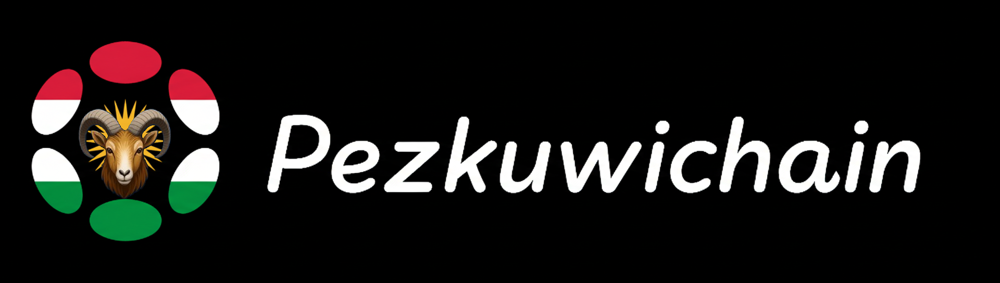
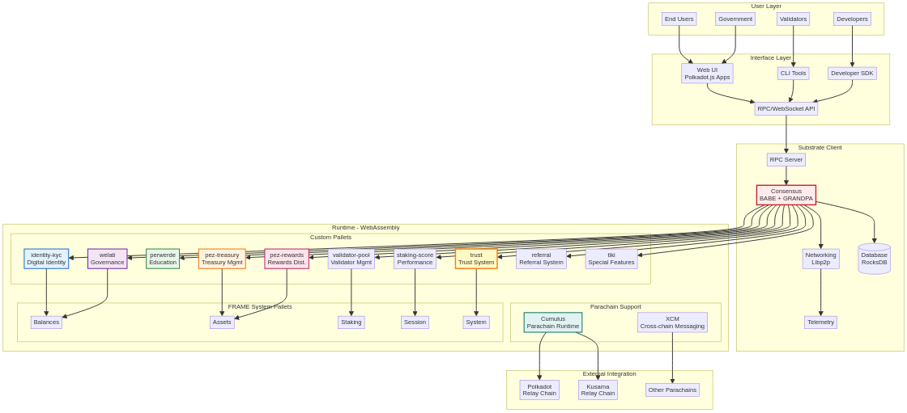
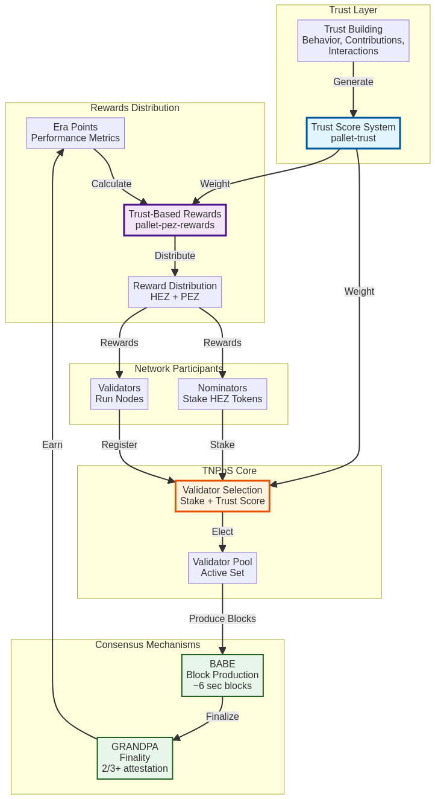
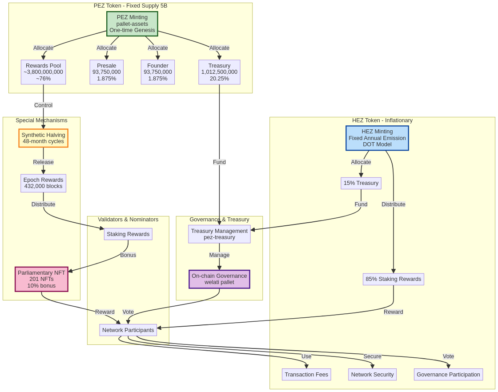
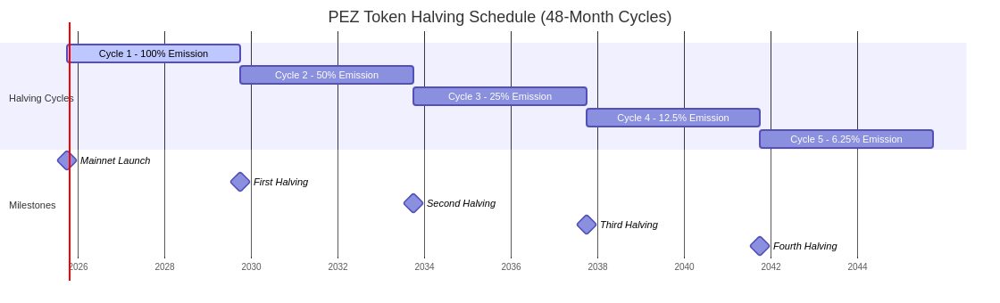

# PezkuwiChain: A Sovereign Blockchain for a Digital Nation
**Technical Whitepaper · Version 3.0 · June 2026**

*Revision 3.0 supersedes v2.0 (October 2025): restructured with a dedicated Philosophy section and a code-verified TNPoS trust-score model — main formula, the four component scores, and on-chain constants — with module terminology corrected to* pezpallet*.*
**Prepared by:** Digital Kurdistan Tech Institute & PezkuwiChain Contributors



---

## Abstract

PezkuwiChain is a sovereign Layer-1 blockchain engineered to provide digital public infrastructure for the Kurdish people and their global diaspora. It is built on the **Pezkuwi SDK** — a self-contained, modular runtime framework derived from battle-tested open-source components and now fully independent, building entirely from source with no dependency on any external package registry.

The protocol's central contribution is **Trust-enhanced Nominated Proof-of-Stake (TNPoS)**, a consensus and reward model that augments conventional economic stake with an on-chain reputation signal — the *trust score* — computed by the `pezpallet-trust` module from each account's staking activity, referrals, on-chain education credentials, and community participation. By weighting influence and rewards by both stake and trust, PezkuwiChain mitigates the stake-only plutocracy of traditional Proof-of-Stake while preserving its economic security guarantees.

PezkuwiChain pairs a **dual-token economy** — HEZ (the inflationary security and fee token) and PEZ (a fixed 5-billion-supply governance and reward token) — with a multi-chain **"teyrchain" architecture**: a Relay Chain for shared security, an Asset Hub for the economy, and a People Chain for identity and governance. A suite of **14 custom pezpallets** provides digital identity, education, reputation, and governance as native on-chain primitives.

This document specifies the PezkuwiChain architecture, the TNPoS consensus and trust-score model, the dual-token economy, the custom pezpallet suite, and the network's technical parameters.

## Our Philosophy

### The Age of Noise

Blockchain technology arrived with the promise of decentralization, transparency, and freedom. Much of that promise, however, was turned into a speculative casino — thousands of projects and tens of thousands of tokens engineered to glitter briefly on exchange listings before fading, exploiting the hopes of their holders. Exchanges became gatekeepers of volume rather than technology, and genuine engineering was lost amid meme tokens and projects of no technical substance. PezkuwiChain is built in deliberate opposition to that noise: we treat technology not as an instrument of speculation, but as infrastructure for building a society.

### Trust, Not Capital

Power has historically concentrated around capital, and traditional Proof-of-Stake carried that pattern into the digital realm — those who hold the most tokens make the rules. PezkuwiChain rejects *pure* stake-plutocracy. In its trust model (Section 4.2), stake is a necessary foundation — and is itself rewarded — but per unit, verifiable contribution (referrals, education, community) is weighted three times more heavily than capital (300 vs 100). Capital opens the door; contribution earns standing within it.

TNPoS is therefore based not only on the balance in a wallet (stake), but on the value an account brings to the network — its reputation and trustworthiness (trust). The network is governed by the trustworthy as well as the wealthy; validators earn standing by demonstrating contribution, not only by locking tokens. The **HEZ** token provides security and economic foundation, while the **PEZ** token rewards labor, participation, and trust. This balance between the power of capital and the value of contribution is enforced in code (Section 4.2), not by policy alone.

### A Clean Slate: The Stateless Advantage

PezkuwiChain also reflects a particular historical circumstance. Established states must refactor centuries of bureaucracy and centralized, paper-based institutions to enter the blockchain era; they cannot build anew without first dismantling the old. A stateless people carries no such legacy — no inefficient bureaucracies to transform, no decrepit institutions to tear down. That absence becomes a digital clean slate: an opportunity to **build rather than adapt**, constructing advanced technology, transparent governance, and an equitable economy directly from the ground up.

In an age where borders are increasingly drawn in code rather than soil, this is PezkuwiChain's ambition — to give the people of this region a direct path to an advanced, fully digital civic infrastructure: a **Type-1 digital civilization** founded on trust and shared values rather than capital and borders alone.

---

## 1. Executive Summary

PezkuwiChain is a sovereign Layer-1 blockchain network meticulously engineered to serve the digital infrastructure needs of the Kurdistan region and its global diaspora. Built using the **Pezkuwi SDK**—a powerful framework forged from battle-tested, open-source components—PezkuwiChain introduces a novel **Trust-enhanced Nominated Proof-of-Stake (TNPoS)** consensus mechanism, a sophisticated dual-token economic model, and a comprehensive suite of custom-built pallets for governance, identity, and education.

The project's vision is to empower the Kurdish nation through decentralized technology, fostering a transparent, community-driven ecosystem that integrates financial inclusion, digital identity, and social trust into its core consensus layer. This whitepaper provides a comprehensive overview of the PezkuwiChain architecture, its groundbreaking TNPoS consensus, technical specifications, and strategic roadmap.

**Core Innovations:**
*   **TNPoS Consensus:** The world's first trust-augmented PoS mechanism.
*   **Dual-Token Economy:** HEZ (inflationary) + PEZ (fixed 5B supply).
*   **Multi-Layered "Teyrchain" Architecture:** A Relay Chain for consensus, an Asset Hub for economy, and a People Chain for identity and governance.
*   **The Pezkuwi SDK:** A powerful and flexible framework with **14** specialized pezpallets for digital sovereignty.

---

## 2. Introduction

The emergence of blockchain technology has offered unprecedented opportunities to create decentralized, transparent, and secure digital infrastructures. However, most existing blockchain solutions are designed as general-purpose platforms, often failing to address the specific cultural, economic, and governance needs of distinct communities. PezkuwiChain was born from the vision of creating a dedicated digital state for the Kurdish nation, aiming to leverage the power of the blockchain to address long-standing challenges and build a foundation for a prosperous digital future. The mission is to serve the public by providing the Kurdish people with a secure and decentralized platform for financial services, digital identity, democratic governance, and education.

---

## 3. The Problem

Traditional financial and administrative systems often present significant barriers to entry, lack transparency, and are ill-suited to the unique needs of a globally dispersed yet culturally unified nation. The Kurdish people face distinct challenges that a sovereign digital infrastructure can address:

- **Financial Exclusion:** A significant portion of the population lacks access to modern banking and financial services.
- **Lack of Digital Sovereignty:** The absence of a unified, sovereign digital identity system complicates civic participation and access to services.
- **Governance Gaps:** Centralized governance models can be opaque and lack mechanisms for broad, democratic participation.
- **Economic Volatility:** National economies are often vulnerable to the volatility of external currencies.
- **The Trust Deficit in Blockchain:** Existing consensus mechanisms fail to incorporate social trust and reputation.

---
## 4. The Solution: PezkuwiChain Architecture

PezkuwiChain is architected as a comprehensive solution for digital sovereignty. It is built using the **Pezkuwi SDK**, a state-of-the-art, modular framework forged from the battle-tested open-source Bizinikiwi framework.

### 4.1. Our Technological Foundation
Our choice of a modular, open-source framework provides PezkuwiChain with a robust and future-proof foundation. The core of this architecture is **Bizinikiwi**, a framework that separates the blockchain's core logic (Runtime) from its client-side functions (Client), allowing for forkless, on-chain upgrades.


*Figure 1: PezkuwiChain System Architecture*

### 4.1.1. Technological Heritage & Independence
PezkuwiChain did not begin in a vacuum. We laid our first stone upon **Polkadot SDK** — the open-source framework engineered by Parity Technologies and the Web3 Foundation, among the most rigorously battle-tested infrastructure ever written for decentralized systems. We are grateful for it, and we say so plainly. The open-source ideal exists precisely so that a stateless nation — with no treasury to commission an army of engineers, and no sovereign to grant it permission — can stand on solid ground and build something of its own. Polkadot gave us that ground, and we honor it.

From there our paths diverged — deliberately, and in time, completely. What began as a fork has forged its own soul: its own framework (**Bizinikiwi**), its own SDK (**Pezkuwi SDK**), its own brand, governance, token economy, and chain identity. Today the entire stack lives in a single self-contained repository that builds from source with **zero dependency on any external registry** — because a sovereign chain must remain buildable and verifiable no matter what happens to any third-party platform.

We preserve our origins in full. Every license, attribution, and record of change is kept in our `NOTICE` and `LICENSE` files, exactly as the Apache-2.0 and GPL-3.0 licenses intend — not as a footnote, but as a matter of honor. We took what was freely given, we gave thanks, and we made it our own. This is the open-source ideal working as it was meant to: not extraction, but inheritance; not imitation, but independence.

### 4.2. Consensus Innovation: Trust-enhanced Nominated Proof-of-Stake (TNPoS)
PezkuwiChain extends conventional Nominated Proof-of-Stake (NPoS) by integrating an on-chain reputation layer into validator selection and reward distribution. This mechanism, **TNPoS**, combines the economic security of NPoS with a social-reputation signal computed by the custom `pezpallet-trust`.

**The Trust Score.** A citizen's trust score is computed by `pezpallet-trust::calculate_trust_score` from four component scores — staking, referral, education (*perwerde*), and community (*tiki*) — combined as a weighted sum that is then gated and scaled by staking:

```
weighted_sum = 100·staking + 300·(referral + perwerde + tiki)
trust_score  = staking × weighted_sum / base
```

where `base` is the configurable `ScoreMultiplierBase`, set to **10,000** in the production People-chain runtime. An account with zero staking has a trust score of zero, regardless of its other components.

| Component | Source pezpallet | Weight | Signal |
|---|---|---|---|
| `staking_score` | `pezpallet-staking-score` | 100 (also gate & multiplier) | Economic commitment and staking history |
| `referral_score` | `pezpallet-referral` | 300 | Verified network growth contributed by the account |
| `perwerde_score` | `pezpallet-perwerde` | 300 | On-chain education and certification credentials (*perwerde* = "education") |
| `tiki_score` | community participation | 300 | Social-graph and engagement signal |

Two design properties follow directly from this formula. First, **staking is the foundation**: trust is gated on economic commitment — zero stake yields zero trust — and stake also enters the formula multiplicatively, amplifying the entire score. Second, **contribution outweighs capital per unit**: referral, education, and community signals each carry three times the per-unit weight of staking (300 vs 100), rewarding verifiable contribution over capital alone, once the staking foundation is met.

**Component Scores.** Each input to the trust score is itself computed on-chain by a dedicated pezpallet.

*Staking score* (`pezpallet-staking-score`) rewards both the size and the duration of a citizen's stake. A tiered amount score (by total HEZ staked) is multiplied by a duration factor:

| Staked (HEZ) | Amount score | | Stake duration | Multiplier |
|---|---|---|---|---|
| ≤ 100 | 20 | | ≥ 12 months | ×2.0 |
| ≤ 250 | 30 | | 6–11 months | ×1.7 |
| ≤ 750 | 40 | | 3–5 months | ×1.4 |
| 751+ | 50 | | 1–2 months | ×1.2 |
| | | | < 1 month | ×1.0 |

`staking_score = amount_score × duration_multiplier`  — zero if the citizen has no stake.

*Referral score* (`pezpallet-referral`) rewards verified network growth, counting only *good* referrals (total minus those later revoked) on a saturating tiered curve capped at 500, less any accumulated penalty:

```
good = total_referrals − revoked_referrals
base = good × 10              for 1–10     (→ 10…100)
     = 100 + (good − 10) × 5  for 11–50    (→ 105…300)
     = 300 + (good − 50) × 4  for 51–100   (→ 304…500)
     = 500                    for 101+
referral_score = base − penalty
```

*Education score* (`pezpallet-perwerde`; *perwerde* = "education") is the sum of points earned across all **completed** courses, each capped by `MaxPointsPerCourse` (**1,000** points):

`perwerde_score = Σ points_earned`  (over completed course enrollments)

*Community score* (`pezpallet-tiki`) is the sum of fixed bonuses attached to the role and contribution badges ("tikis") a citizen holds; each tiki type carries a protocol-defined value:

`tiki_score = Σ bonus(tiki)`  (over the citizen's tikis)

The composite trust score is cached per account in `pezpallet-trust` (alongside a network-wide `TotalActiveTrustScore`) and consumed by other modules through the `TrustScoreProvider` interface — most notably the reward module (`pezpallet-pez-rewards`), which weights PEZ reward distribution by trust, and the governance layer.

### Computation Model and State Efficiency

Trust scores are maintained through a hybrid of event-driven updates and bounded periodic reconciliation, rather than by a naïve full-population recomputation. When an account's underlying data changes — a new confirmed referral, a completed course, or a staking update — the corresponding component pezpallet (`pezpallet-staking-score`, `pezpallet-referral`, `pezpallet-perwerde`, `pezpallet-tiki`) notifies `pezpallet-trust` via a callback (`on_score_component_changed`), which immediately recomputes and caches the trust score for that single account. A periodic reconciliation pass also exists, but it is explicitly bounded: each cycle processes only an optimally-sized batch of accounts and persists a resume cursor (`LastProcessedAccount`, with O(1) `iter_from` resume), so the population is swept incrementally across blocks — no single block ever processes the entire user base.

Component scores are derived on read from their source data rather than stored as separate state: the education score is computed at query time from a citizen's completed course enrollments, and the referral score from accumulated referrer statistics. Only the composite trust score is cached. As a result, the trust system's persistent state grows with genuine activity, not with raw population. A dormant account produces no recurring *write* cost: the bounded sweep still visits it, but because its score is unchanged it triggers no state mutation — the update path writes to chain state only when `old_score != new_score`.

Large or content-heavy data is never placed on-chain. Course materials are referenced by IPFS content links (`content_link`); only the reference and minimal scoring metadata live in chain state. The citizenship layer is privacy-preserving by construction: no personal data is stored on-chain — only an `H256` commitment hash derived off-chain from a citizen's identity. Together, these keep the People-chain state footprint proportional to genuine network activity rather than to the total number of registered citizens.


*Figure 2: TNPoS Consensus Flow*

---

## 5. Dual-Token Economic Model

PezkuwiChain introduces an innovative dual-token economic model.


*Figure 3: Dual-Token Economy Flow*

### 5.1. HEZ: The Currency of Security
HEZ is the native token used for staking, transaction fees, and network security. It is inflationary: staking rewards are funded by era-based inflation bounded between **2.5% and 10%** per annum (`MinInflation` / `MaxInflation`), perpetually incentivizing staking participation.

### 5.2. PEZ: The Currency of Governance
PEZ is a fixed-supply token — **5,000,000,000 units**, fixed at genesis — used for trust-based rewards and as the backing of governance. Of total supply, **76% (3.8 billion PEZ)** forms the rewards pool, released on a **synthetic halving schedule** managed by `pezpallet-pez-treasury`: funds are released monthly to the incentive and government pots, and the monthly release amount halves at the start of every **48-month period** (`HALVING_PERIOD_BLOCKS` = 20,736,000 blocks, ~4 years at 6-second blocks).

Released incentive funds are distributed by `pezpallet-pez-rewards` on a per-epoch basis, **weighted by trust rather than holdings**: each citizen's share is `user_trust_score / total_active_trust_score × epoch_pool`, with 10% of each epoch's pool reserved for role-badge (NFT) holders and a one-week claim window after which unclaimed rewards are clawed back. Rewards therefore flow to verifiable contribution and trust, consistent with the TNPoS design.


*Figure 4: PEZ Token Halving Schedule*

---
## 6. Core Features & Custom Pezpallets

The true power of PezkuwiChain lies in the **Pezkuwi SDK**, a collection of **14 custom pezpallets** that provide the tools for digital nation-building.

- **Economic Pallets (on Asset Hub):** `pezpallet-pez-treasury`, `pezpallet-token-wrapper`.
- **Social & Identity Pallets (on People Chain):** `pezpallet-identity-kyc`, `pezpallet-trust`, `pezpallet-referral`, `pezpallet-perwerde`, `pezpallet-tiki`, `pezpallet-society`.
- **Governance & Staking Pallets:** `pezpallet-welati`, `pezpallet-pez-rewards`, `pezpallet-staking-score`, `pezpallet-validator-pool`.

---

## 7. Technical Specifications & 8. Network Architecture
PezkuwiChain is a decentralized network of validators, nominators, and full nodes, secured by **Nominated Proof-of-Stake (NPoS)** with validators elected through a Sequential Phragmén algorithm. It uses a hybrid consensus: **BABE** for block production — a fixed **6-second block time** (`MILLISECS_PER_BLOCK = 6000`) — and **GRANDPA** for deterministic, provable finality. The runtime is a Wasm binary, enabling forkless on-chain upgrades.

---

## 9. Governance Model & 10. Security
Governance is conducted on-chain through the `welati` pezpallet as a **citizen-based electoral system — not a token-weighted vote**. Participation requires verified citizenship (a KYC-approved identity), and each citizen casts one vote per election. Major elections use strict **one-citizen-one-vote** (equal weight); for other ballots, vote weight is derived from trust score and **bounded to a 1–10× range** (`trust_score / 100`, clamped), so influence reflects reputation without being dominated — and is **never a function of token balance**. Candidacy is itself trust-gated: standing for an elected office requires a minimum trust score, and endorsements require endorsers to hold trust above a threshold. Citizens elect officeholders and representative bodies and vote on proposals; in keeping with the TNPoS principle, governance weight derives from citizenship and trust, never from capital. Security is multi-layered. At the implementation layer, the runtime is written in memory-safe Rust on the battle-tested Bizinikiwi framework, and forkless on-chain upgrades allow vulnerabilities to be patched without a hard fork. At the consensus layer, validator misbehaviour — equivocation and disputes — is penalized by **economic slashing** and **automatic validator disabling** (`AlwaysDisableForSlashGreaterThan`). At the social layer, TNPoS adds reputational disincentives: a bad actor forfeits the trust-weighted rewards and governance standing that the trust score confers.

---
## 11. Roadmap & 12. Use Cases
PezkuwiChain advanced through a disciplined, phased rollout: Alpha and Beta testnets, the Zagros staging network, and a production Mainnet. With the base layer in production, development focus is on ecosystem growth — a treasury-funded grants program, developer onboarding, and the wallet, exchange, and citizenship applications. Target use cases span Digital Identity, on-chain Governance, Decentralized Finance, and Education, each served by dedicated pezpallets.

---

## 13. Team & 14. Ecosystem
PezkuwiChain is an initiative led by the Digital Kurdistan Tech Institute, supported by a global community of contributors. The architecture is designed for interoperability within the broader blockchain ecosystem.

---
## 15. Legal & 16. Conclusion
The project operates under the Kurdistan Talent Institute License. It is a utility-focused platform, not an investment vehicle. PezkuwiChain represents a paradigm shift, providing a foundational layer for a new digital state, built on the principles of trust, transparency, and sovereignty.

---
## 17. References

### Academic and Technical Papers
1.  **Polkadot: Vision for a Heterogeneous Multi-Chain Framework** - Dr. Gavin Wood, 2016.
2.  **BABE: Blind Assignment for Blockchain Extension** - Web3 Foundation Research.
3.  **GRANDPA: A Byzantine Finality Gadget** - Web3 Foundation Research.
4.  **Nominated Proof-of-Stake (NPoS)** - Web3 Foundation Documentation.
5.  **XCM: The Cross-Consensus Message Format** - Polkadot Wiki.
6.  **Substrate: A Blockchain Framework for a Multichain Future** — Parity Technologies. *(PezkuwiChain's Bizinikiwi framework is a renamed, independently-maintained derivative of Substrate; see the project `NOTICE` file.)*

### Project Resources
1.  **PezkuwiChain GitHub Repository** - `https://github.com/pezkuwichain/pezkuwi-DKS`
2.  **pezpallet-pez-treasury Source Code** - `pezcumulus/teyrchains/pezpallets/pez-treasury`
3.  **pezpallet-pez-rewards Source Code** - `pezcumulus/teyrchains/pezpallets/pez-rewards`
4.  **pezpallet-trust Source Code** - `pezcumulus/teyrchains/pezpallets/trust`

---
## 18. Contact & Resources

### Official Channels
*   **Website:** `https://pezkuwichain.io`
*   **GitHub:** `https://github.com/pezkuwichain/pezkuwi-DKS`
*   **Documentation:** `https://docs.pezkuwichain.io`
*   **Block Explorer:** `https://explorer.pezkuwichain.io`

### Email Contacts
*   **General Inquiries:** `info@pezkuwichain.io`
*   **Technical Support:** `tech@pezkuwichain.io`
*   **Institutional Relations:** `gov@pezkuwichain.io`, `admin@pezkuwichain.io`

### Developer Resources
*   **Developer Portal:** `https://developers.pezkuwichain.io`
*   **API Documentation:** `https://api.pezkuwichain.io/docs`
*   **Testnet Faucet:** `https://faucet.pezkuwichain.io`
*   **Grants Program:** `https://grants.pezkuwichain.io`

---
## 19. Appendix A: Glossary

- **BABE (Blind Assignment for Blockchain Extension):** The block production mechanism that randomly assigns slots to validators.
- **Teyrchain:** The Pezkuwi SDK term for a parachain; a blockchain that connects to a relay chain for shared security.
- **Era:** A period in the staking system (typically ~24 hours) after which HEZ staking rewards are calculated.
- **Epoch:** A longer period (432,000 blocks, ~30 days) used for PEZ reward distribution.
- **Finality:** The guarantee that a block cannot be reverted. GRANDPA provides finality for PezkuwiChain.
- **FRAME:** The framework used for building blockchain runtimes with modular pallets.
- **HEZ:** The native inflationary token of PezkuwiChain, used for staking, transaction fees, and network security.
- **NPoS (Nominated Proof-of-Stake):** The consensus mechanism where nominators elect validators.
- **Pezpallet:** A modular component in the Bizinikiwi runtime that provides specific functionality.
- **PEZ:** The fixed-supply governance token of PezkuwiChain (5 billion total), used for governance and rewards.
- **TNPoS (Trust-enhanced Nominated Proof-of-Stake):** PezkuwiChain's novel consensus mechanism that integrates trust scores.
- **Trust Score:** A reputation metric calculated by `pezpallet-trust`.
- **Wasm (WebAssembly):** The portable binary instruction format used for the PezkuwiChain runtime, enabling forkless upgrades.
- **welati:** The governance pezpallet for PezkuwiChain. The name means "citizen" in Kurdish.
- **perwerde:** The education and certification pezpallet. The name means "education" in Kurdish.
- **XCM (Cross-Consensus Messaging):** A messaging format for communication between different consensus systems.

---
## 20. Appendix B: Developer Resources

### Getting Started
**Node Setup:**
```bash
# Clone the repository
git clone https://github.com/pezkuwichain/pezkuwi-DKS.git
cd pezkuwi-DKS
# Compile the node
cargo build --release
# Run a development node
./target/release/pezkuwi-node --dev
```

### SDKs & Libraries
**JavaScript/TypeScript:**
```bash
npm install @pezkuwichain/api
```
```typescript
import { ApiPromise, WsProvider } from '@pezkuwichain/api';
const provider = new WsProvider('wss://rpc.pezkuwichain.io');
const api = await ApiPromise.create({ provider });
// Query the trust score
const trustScore = await api.query.trust.trustScores(accountId);
```

### Community Support
*   **Developer Forum:** `https://forum.pezkuwichain.io`
*   **Discord #developers:** `https://discord.gg/pezkuwichain`
