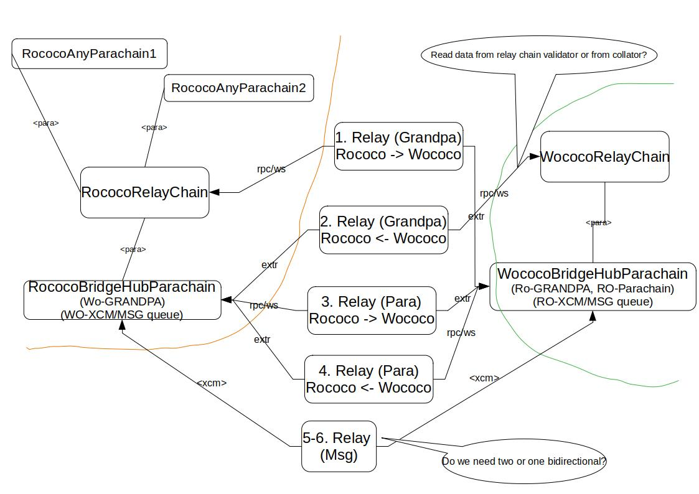

- [Bridge-hub Teyrchains](#bridge-hub-teyrchains)
  - [Requirements for local run/testing](#requirements-for-local-runtesting)
  - [How to test local pezkuwichain <-> zagros bridge](#how-to-test-local-pezkuwichain---zagros-bridge)
	  - [Run pezkuwichain/zagros chains with zombienet](#run-pezkuwichainzagros-chains-with-zombienet)
	  - [Init bridge and run relayer between BridgeHubpezkuwichain and
		BridgeHubzagros](#init-bridge-and-run-relayer-between-bridgehubpezkuwichain-and-bridgehubzagros)
	  - [Initialize configuration for transfer asset over bridge
		(TYRs/WNDs)](#initialize-configuration-for-transfer-asset-over-bridge-rocswnds)
	  - [Send messages - transfer asset over bridge (TYRs/WNDs)](#send-messages---transfer-asset-over-bridge-rocswnds)
	  - [Claim relayer's rewards on BridgeHubpezkuwichain and
		BridgeHubzagros](#claim-relayers-rewards-on-bridgehubpezkuwichain-and-bridgehubzagros)
  - [How to test local BridgeHubDicle/BridgeHubPezkuwiChain](#how-to-test-local-bridgehubdiclebridgehubpezkuwi)

# Bridge-hub Teyrchains

_BridgeHub(s)_ are **_system teyrchains_** that will house trustless bridges from the local ecosystem to others. The
current trustless bridges planned for the BridgeHub(s) are:
- `BridgeHubPezkuwiChain` system teyrchain:
	1. PezkuwiChain <-> Dicle bridge
	2. PezkuwiChain <-> Ethereum bridge (Snowbridge)
- `BridgeHubDicle` system teyrchain:
	1. Dicle <-> PezkuwiChain bridge
	2. Dicle <-> Ethereum bridge The high-level
	responsibilities of each bridge living on BridgeHub:
- sync finality proofs between relay chains (or equivalent)
- sync finality proofs between BridgeHub teyrchains
- pass (XCM) messages between different BridgeHub teyrchains



## Requirements for local run/testing

```
# Prepare empty directory for testing
mkdir -p ~/local_bridge_testing/bin
mkdir -p ~/local_bridge_testing/logs

---
# 1. Install zombienet
Go to: https://github.com/paritytech/zombienet/releases
Copy the appropriate binary (zombienet-linux) from the latest release to ~/local_bridge_testing/bin


---
# 2. Build pezkuwi binary

We need pezkuwi binary with "fast-runtime" feature:

cd <pezkuwi-sdk-git-repo-dir>
cargo build --release --features fast-runtime --bin pezkuwi
cp target/release/pezkuwi ~/local_bridge_testing/bin/pezkuwi

cargo build --release --features fast-runtime --bin pezkuwi-prepare-worker
cp target/release/pezkuwi-prepare-worker ~/local_bridge_testing/bin/pezkuwi-prepare-worker

cargo build --release --features fast-runtime --bin pezkuwi-execute-worker
cp target/release/pezkuwi-execute-worker ~/local_bridge_testing/bin/pezkuwi-execute-worker


---
# 3. Build bizinikiwi-relay binary
git clone https://github.com/paritytech/parity-bridges-common.git
cd parity-bridges-common

# checkout desired branch or use master:
# git checkout -b master --track origin/master
# `pezkuwi-staging` (recommended) is stabilized and compatible for Pezcumulus releases
# `master` is latest development
git checkout -b pezkuwi-staging --track origin/pezkuwi-staging

cargo build --release -p bizinikiwi-relay
cp target/release/bizinikiwi-relay ~/local_bridge_testing/bin/bizinikiwi-relay


---
# 4. Build pezcumulus pezkuwi-teyrchain binary
cd <pezkuwi-sdk-git-repo-dir>

cargo build --release -p pezkuwi-teyrchain-bin
cp target/release/pezkuwi-teyrchain ~/local_bridge_testing/bin/pezkuwi-teyrchain
cp target/release/pezkuwi-teyrchain ~/local_bridge_testing/bin/pezkuwi-teyrchain-asset-hub
```

## How to test local pezkuwichain <-> zagros bridge

### Run pezkuwichain/zagros chains with zombienet

```
cd <pezkuwi-sdk-git-repo-dir>

# pezkuwichain + BridgeHubpezkuwichain + AssetHub for pezkuwichain (mirroring Dicle)
PEZKUWI_BINARY=~/local_bridge_testing/bin/pezkuwi \
PEZKUWI_TEYRCHAIN_BINARY=~/local_bridge_testing/bin/pezkuwi-teyrchain \
	~/local_bridge_testing/bin/zombienet-linux --provider native spawn ./bridges/testing/environments/pezkuwichain-zagros/bridge_hub_pezkuwichain_local_network.toml
```

```
cd <pezkuwi-sdk-git-repo-dir>

# zagros + BridgeHubzagros + AssetHub for zagros (mirroring PezkuwiChain)
PEZKUWI_BINARY=~/local_bridge_testing/bin/pezkuwi \
PEZKUWI_TEYRCHAIN_BINARY=~/local_bridge_testing/bin/pezkuwi-teyrchain \
	~/local_bridge_testing/bin/zombienet-linux --provider native spawn ./bridges/testing/environments/pezkuwichain-zagros/bridge_hub_zagros_local_network.toml
```

### Init bridge and run relayer between BridgeHubpezkuwichain and BridgeHubzagros

**Accounts of BridgeHub teyrchains:**
- `Bob` is pezpallet owner of all bridge pallets

#### Run with script
```
cd <pezkuwi-sdk-git-repo-dir>

./bridges/testing/environments/pezkuwichain-zagros/bridges_pezkuwichain_zagros.sh run-pez-finality-relay
```

**Check relay-chain headers relaying:**
- pezkuwichain teyrchain: - https://pezkuwichain.io/?rpc=ws%3A%2F%2F127.0.0.1%3A8943#/chainstate - Pezpallet:
  **bridgezagrosGrandpa** - Keys: **bestFinalized()**
- zagros teyrchain: - https://pezkuwichain.io/?rpc=ws%3A%2F%2F127.0.0.1%3A8945#/chainstate - Pezpallet:
  **bridgepezkuwichainGrandpa** - Keys: **bestFinalized()**

**Check teyrchain headers relaying:**
- pezkuwichain teyrchain: - https://pezkuwichain.io/?rpc=ws%3A%2F%2F127.0.0.1%3A8943#/chainstate - Pezpallet:
  **bridgezagrosTeyrchains** - Keys: **parasInfo(None)**
- zagros teyrchain: - https://pezkuwichain.io/?rpc=ws%3A%2F%2F127.0.0.1%3A8945#/chainstate - Pezpallet:
  **bridgepezkuwichainTeyrchains** - Keys: **parasInfo(None)**

### Initialize configuration for transfer asset over bridge (TYRs/WNDs)

This initialization does several things:
- creates `ForeignAssets` for wrappedTYRs/wrappedWNDs
- drips SA for AssetHubpezkuwichain on AssetHubzagros (and vice versa) which holds reserved assets on source chains
```
cd <pezkuwi-sdk-git-repo-dir>

./bridges/testing/environments/pezkuwichain-zagros/bridges_pezkuwichain_zagros.sh init-asset-hub-pezkuwichain-local
./bridges/testing/environments/pezkuwichain-zagros/bridges_pezkuwichain_zagros.sh init-bridge-hub-pezkuwichain-local
./bridges/testing/environments/pezkuwichain-zagros/bridges_pezkuwichain_zagros.sh init-asset-hub-zagros-local
./bridges/testing/environments/pezkuwichain-zagros/bridges_pezkuwichain_zagros.sh init-bridge-hub-zagros-local
```

### Send messages - transfer asset over bridge (TYRs/WNDs)

Do reserve-backed transfers:
```
cd <pezkuwi-sdk-git-repo-dir>

# TYRs from pezkuwichain's Asset Hub to zagros's.
./bridges/testing/environments/pezkuwichain-zagros/bridges_pezkuwichain_zagros.sh reserve-transfer-assets-from-asset-hub-pezkuwichain-local
```
```
cd <pezkuwi-sdk-git-repo-dir>

# ZGRs from zagros's Asset Hub to pezkuwichain's.
./bridges/testing/environments/pezkuwichain-zagros/bridges_pezkuwichain_zagros.sh reserve-transfer-assets-from-asset-hub-zagros-local
```

- open explorers: (see zombienets)
	- AssetHubpezkuwichain (see events `xcmpQueue.XcmpMessageSent`, `pezkuwiXcm.Attempted`) https://pezkuwichain.io/?rpc=ws://127.0.0.1:9910#/explorer
	- BridgeHubpezkuwichain (see `bridgezagrosMessages.MessageAccepted`) https://pezkuwichain.io/?rpc=ws://127.0.0.1:8943#/explorer
	- BridgeHubzagros (see `bridgepezkuwichainMessages.MessagesReceived`, `xcmpQueue.XcmpMessageSent`) https://pezkuwichain.io/?rpc=ws://127.0.0.1:8945#/explorer
	- AssetHubzagros (see `foreignAssets.Issued`, `xcmpQueue.Success`) https://pezkuwichain.io/?rpc=ws://127.0.0.1:9010#/explorer
	- BridgeHubpezkuwichainc (see `bridgezagrosMessages.MessagesDelivered`) https://pezkuwichain.io/?rpc=ws://127.0.0.1:8943#/explorer

Do reserve withdraw transfers: (when previous is finished)
```
cd <pezkuwi-sdk-git-repo-dir>

# wrappedWNDs from pezkuwichain's Asset Hub to zagros's.
./bridges/testing/environments/pezkuwichain-zagros/bridges_pezkuwichain_zagros.sh withdraw-reserve-assets-from-asset-hub-pezkuwichain-local
```
```
cd <pezkuwi-sdk-git-repo-dir>

# wrappedTYRs from zagros's Asset Hub to pezkuwichain's.
./bridges/testing/environments/pezkuwichain-zagros/bridges_pezkuwichain_zagros.sh withdraw-reserve-assets-from-asset-hub-zagros-local
```

### Claim relayer's rewards on BridgeHubpezkuwichain and BridgeHubzagros

**Accounts of BridgeHub teyrchains:**
- `//Charlie` is relayer account on BridgeHubpezkuwichain
- `//Charlie` is relayer account on BridgeHubzagros

```
cd <pezkuwi-sdk-git-repo-dir>

# Claim rewards on BridgeHubzagros:
./bridges/testing/environments/pezkuwichain-zagros/bridges_pezkuwichain_zagros.sh claim-rewards-bridge-hub-pezkuwichain-local

# Claim rewards on BridgeHubzagros:
./bridges/testing/environments/pezkuwichain-zagros/bridges_pezkuwichain_zagros.sh claim-rewards-bridge-hub-zagros-local
```

- open explorers: (see zombienets)
	- BridgeHubpezkuwichain (see 2x `bridgeRelayers.RewardPaid`) https://pezkuwichain.io/?rpc=ws://127.0.0.1:8943#/explorer
	- BridgeHubzagros (see 2x `bridgeRelayers.RewardPaid`) https://pezkuwichain.io/?rpc=ws://127.0.0.1:8945#/explorer

## How to test local BridgeHubDicle/BridgeHubPezkuwiChain

TODO: see `# !!! READ HERE` above
